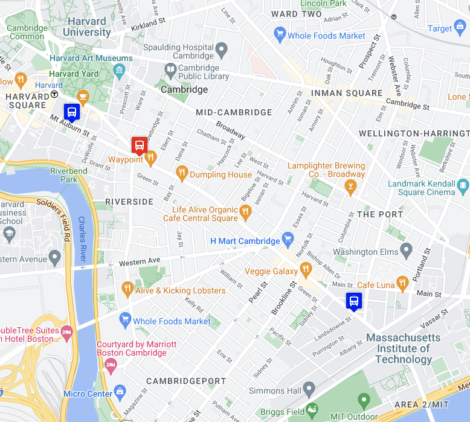

# Real Time Bus Tracker

## Description
This exercise uses an API to source real-time bus data from the Boston Massachusetts Bay Transportation Authority (MBTA). When loaded to your browser, the MBTA is queried every 15 seconds to pull down current data for all buses on route 1; a bus route between the MIT campus and Harvard campus. The location of the buses are displayed live on a map by capturing the latitude and longitude data and creating a visual representation of those coordinates (i.e. blue and red bus icons) within a mapping platform. The blue bus icon denotes a bus traveling toward the MIT campus and a red bus icon denotes a bus traveling toward the Harvard campus.

## How to Run
Navigate to https://api-v3.mbta.com/ where you can make a developer account and request an API key. Add your API key to the mapanimation.js file where indicated and load the index.html file onto your browser to run :)
 
<a href="https://kayla-day.github.io/Real-Time-Bus-Tracker/">Give it a try!</a>

## Future Improvements
No further development planned at this time. 

## License
MIT License

Copyright (c) 2023 Kayla Guimont

Permission is hereby granted, free of charge, to any person obtaining a copy of this software and associated documentation files (the "Software"), to deal in the Software without restriction, including without limitation the rights to use, copy, modify, merge, publish, distribute, sublicense, and/or sell copies of the Software, and to permit persons to whom the Software is furnished to do so, subject to the following conditions:

The above copyright notice and this permission notice shall be included in all copies or substantial portions of the Software.

THE SOFTWARE IS PROVIDED "AS IS", WITHOUT WARRANTY OF ANY KIND, EXPRESS OR IMPLIED, INCLUDING BUT NOT LIMITED TO THE WARRANTIES OF MERCHANTABILITY, FITNESS FOR A PARTICULAR PURPOSE AND NONINFRINGEMENT. IN NO EVENT SHALL THE AUTHORS OR COPYRIGHT HOLDERS BE LIABLE FOR ANY CLAIM, DAMAGES OR OTHER LIABILITY, WHETHER IN AN ACTION OF CONTRACT, TORT OR OTHERWISE, ARISING FROM, OUT OF OR IN CONNECTION WITH THE SOFTWARE OR THE USE OR OTHER DEALINGS IN THE SOFTWARE.

